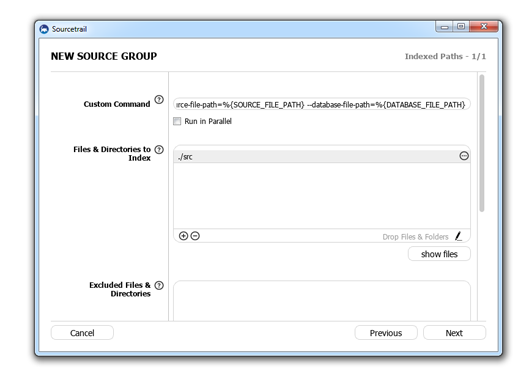

# SourcetrailPerlIndexer
Perl Indexer for [Sourcetrail](https://www.sourcetrail.com/) based on [PPI](https://metacpan.org/pod/PPI) and [SourcetrailDB](https://github.com/CoatiSoftware/SourcetrailDB)


## Description
The SourcetrailPerlIndexer project is a Sourcetrail language extension that brings Perl support to Sourcetrail. This project is still in a prototype state, but you can already run it on your Perl code!


## Requirements
* [Perl](https://www.perl.org)
* [PPI](https://metacpan.org/pod/PPI)
* [SourcetrailDB](https://github.com/CoatiSoftware/SourcetrailDB) Perl bindings


## Setup
* Check out this repository
* Install PPI by running `cpanm PPI` or `cpanp i PPI`
* Download the SourcetrailDB Perl bindings for your specific Perl version [here](https://github.com/CoatiSoftware/SourcetrailDB/releases) and extract both the `sourcetraildb.so` and the `sourcetraildb.pm` files to the root of the checked out repository


## Running the Source Code
To index an arbitrary Perl source file, execute the command:

```
$ perl run.pl --source-file-path=path/to/your/perl/file.pl --database-file-path=path/to/output/database/file.srctrldb
```

This will index the source file and store the data to the provided database filepath. If the database does not exist, an empty database will be created.

You can access an overview that lists all available command line parameters by providing no arguments, which will print the following output to your console:
```
$ perl run.pl
Usage:
    run.pl [--help] [--man] [--version]
    --database-file-path=DATABASE_FILE_PATH
    --source-file-path=SOURCE_FILE_PATH [--clear] [--verbose]

     Options:

      --help                print brief help message and exit
      --man                 show full documentation and exit
      --version             print version of this program and exit
      --database-file-path  path to the generated Sourcetrail database file (required)
      --source-file-path    path to the generated Sourcetrail database file (required)
      --clear               clear the database before indexing
      --verbose             enable verbose console output
```


## Running the Release

The available [release packages](https://github.com/xanni/SourcetrailPerlIndexer/releases) already contain a functional Perl enviroment and all the dependencies. To index an arbitrary Perl source file just execute the command:

```
$ path/to/SourcetrailPerlIndexer --source-file-path=path/to/your/perl/file.pl --database-file-path=path/to/output/database/file.srctrldb
```


## Executing the Tests
To run the tests for this project, execute the command:
```
$ prove
```


## Contributing
If you like this project and want to get involved, there are lots of ways you can help:

* __Spread the word.__ The more people want this project to grow, the greater the motivation for the developers to get things done.
* __Test the indexer.__ Run it on your own source code. There are still things that are not handled at all or edge cases that have not been considered yet. If you find anything, just create an issue here. Best, include some sample code snippet that illustrates the issue, so we can use it as a basis to craft a test case for our continuous integration and no one will ever break that case again.
* __Write some code.__ Don't be shy here. You can implement whole new features or fix some bugs, but you can also do some refactoring if you think that it benefits the readability or the maintainability of the code. Still, no matter if you just want to work on cosmetics or implement new features, it would be best if you create an issue here on the issue tracker before you actually start handing in pull requests, so that we can discuss those changes first and thus raise the probability that those changes will get pulled quickly.

To create a pull request, follow these steps:
* Fork the Repo on GitHub.
* Make your commits.
* If you added functionality or fixed a bug, please add a test.
* Add your name to the "Code Contributors" section in AUTHORS.txt file.
* Push to your fork and submit a pull request.


## Sourcetrail Integration
To run the perl indexer from within your Sourcetrail installation, follow these steps:
* download the latest [Release](https://github.com/xanni/SourcetrailPerlIndexer/releases) for your OS and extract the package to a directory of your choice
* make sure that you are running Sourcetrail 2018.4.45 or a later version
* add a new "Custom Command Source Group" to a new or to an existing Sourcetrail project
* paste the following string into the source group's "Custom Command" field: `path/to/SourcetrailPerlIndexer --source-file-path=%{SOURCE_FILE_PATH} --database-file-path=%{DATABASE_FILE_PATH}`
* add your Perl files (or the folders that contain those files) to the "Files & Directories to Index" list
* add ".pl" and ".pm" entries to the "Source File Extensions" list (including the dot)
* confirm the settings and start the indexing process


